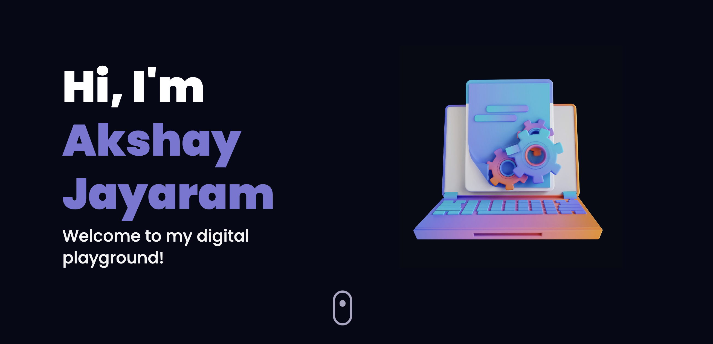

# My Portfolio

Welcome to my portfolio! This project showcases my skills, projects, and experience in a visually engaging manner. 
 

## Overview

I crafted this portfolio site using React, integrating engaging animations via Framer Motion and enhancing UI with Tailwind CSS.

## Features

- **Engaging Animations:** Utilizes Framer Motion for captivating animations throughout the site.
- **UI Enhancement:** Enhanced UI with Tailwind CSS for a sleek and modern design.
- **Reusable Components:** Engineered 11 reusable JSX components to streamline portfolio design across sections.
- **3D Portfolio Elements:** Utilized Three.js and react-three-fiber to render captivating 3D portfolio elements.
- **Vertical Timeline:** Integrated a vertical timeline feature using React’s vertical timeline component.
- **Form Functionality:** Implemented form functionality using emailJS, enhancing user interaction and communication.

## Website Link

Visit my portfolio [here](https://akshay-jayaram.github.io/myWebsite_One/).

## Note

**Please Note:** Kindly enable "Use hardware acceleration when available" under chrome://settings/system to view the ThreeJS models.

